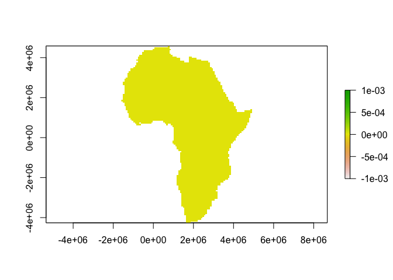
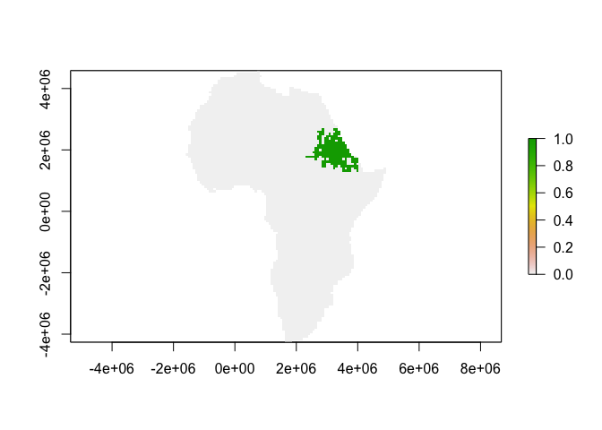
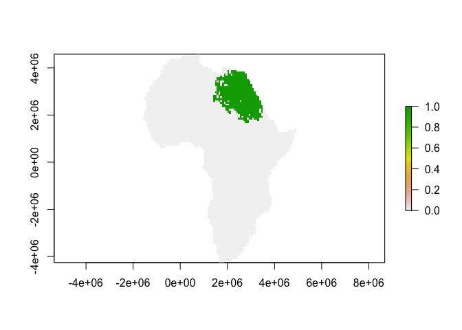
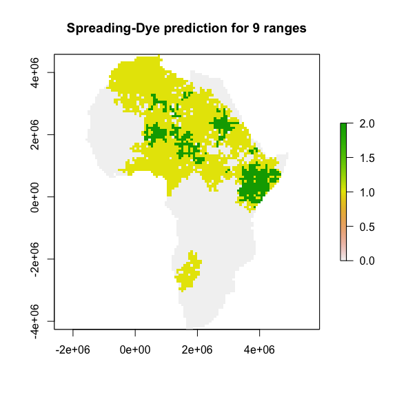

# README

## Load Data

The package ships with a built-in domain file called `africa`


```r
library(raster)
library(SpreadingDye)

data(africa)
plot(africa)
```

<!-- -->

## Grow a range

This is the workhorse function of the package, which grows a taxon range of a specified size (# of pixels) within the domain raster.  The range grows by the spreading-dye model: a random pixel is chosen, and the range expands to a neighboring pixel incrementally until the target range size is reached. Rook's case adjacency is used, meaning that cells are only considered neighbors if they share an edge (i.e. each pixel has only 4 neighbors)


```r
GrowRange(africa, targetRangeSize = 200, showPlot = TRUE)
GrowRange(africa, targetRangeSize = 500, showPlot = TRUE)
```




## Do an MDE simulation

To do an actual MDE simulation, we need to simulate multiple ranges, and see how they accumulate.  


```r
SDMDE(africa, targetRangeSizes = c(500,220,305,525,212,171,192,582,101),showPlot = TRUE)
```

```
## Loading required package: parallel
```

<!-- -->

```
## class       : RasterLayer 
## dimensions  : 118, 87, 10266  (nrow, ncol, ncell)
## resolution  : 75000, 75000  (x, y)
## extent      : -1599809, 4925191, -4264447, 4585553  (xmin, xmax, ymin, ymax)
## coord. ref. : +proj=eck6 +lon_0=0 +x_0=0 +y_0=0 +ellps=WGS84 +units=m +no_defs 
## data source : in memory
## names       : mean_MDE_50iterations 
## values      : 0, 2  (min, max)
```
